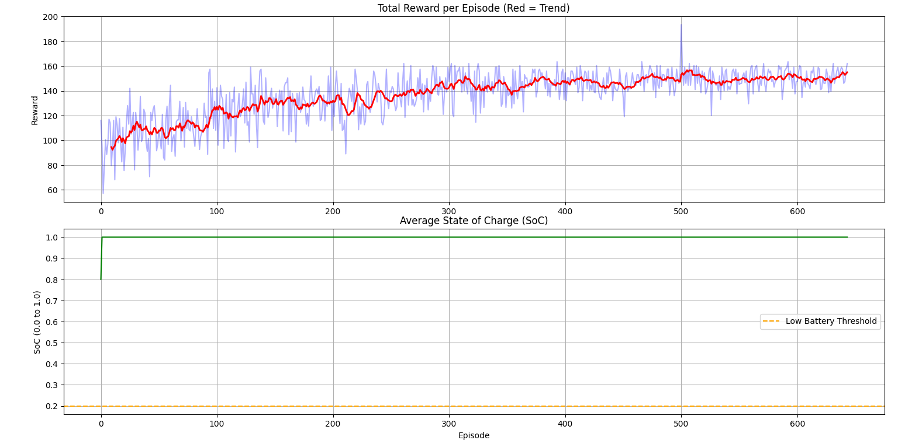

🚀 Multi-Agent Reinforcement Learning for EV Routing:<br>
A specialized MARL framework designed to coordinate Electric Vehicles (EVs) in a shared routing environment. This project utilizes an Actor-Critic architecture to enable decentralized agents to learn optimal routing strategies through centralized training.

📺 Agent Demo:
The training reward curve illustrates the agents' learning progress over [X] episodes. Initially, the agents exhibit low performance due to random exploration of the EV routing environment. As training progresses, the rewards steadily increase and eventually plateau, indicating that the multi-agent system has converged to a stable, coordinated policy where vehicles successfully optimize their routes while minimizing energy consumption or delays.



📌 Project Overview:
This repository focuses on Centralized Training and Decentralized Execution (CTDE). The agents learn to optimize their paths while managing shared resources, ensuring efficient navigation without constant communication during execution.

Architecture: Multi-Agent Actor-Critic

Environment: Custom EV Routing (Gymnasium-based)

Key Features: Reward shaping for efficiency, coordination under constraints, and automated performance logging.

📂 Repository Structure:
```text
MARL-EV-Routing/
├── assets/               # Visuals, plots, and demo GIFs
│   ├── Figure_1.png      # Training performance plot
│   ├── marl_ev_routing.gif # Animated agent demo
│   └── Terminal.png      # Execution logs
├── checkpoints/          # Saved model weights (.pth)
│   └── ev_model_weights.pth
├── results/              # Training data and logs (.csv)
│   ├── ev_marl_results.csv
│   └── ev_marl_results1.csv
├── agent.py              # Actor-Critic agent logic
├── environment.py        # Multi-agent environment definition
├── main.py               # Main training script
├── model.py              # Neural network architectures
├── plot.py               # Script for result visualizations
├── test.py               # Evaluation and testing script
├── visualizer.py         # Helper for rendering agents
└── .gitignore            # Files excluded from Git
```

📊 Results:
The agents demonstrate clear convergence as the training progresses. The plot below illustrates the cumulative reward improvement over episodes, showing the transition from random exploration to stable policy execution.

📈 Analysis of Agent Learning:

Phase 1 (Exploration): High variance in rewards as agents learn the environment constraints.

Phase 2 (Coordination): Emergence of collaborative behavior to avoid routing bottlenecks.

Phase 3 (Convergence): Stable reward plateauing, indicating a robust policy has been reached.